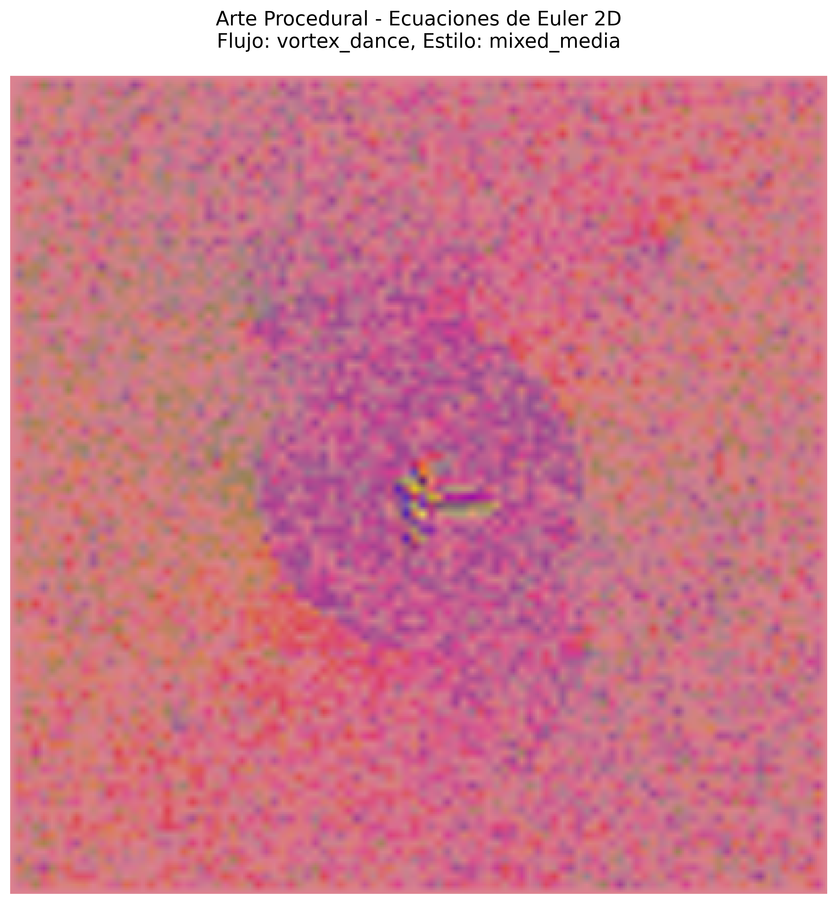
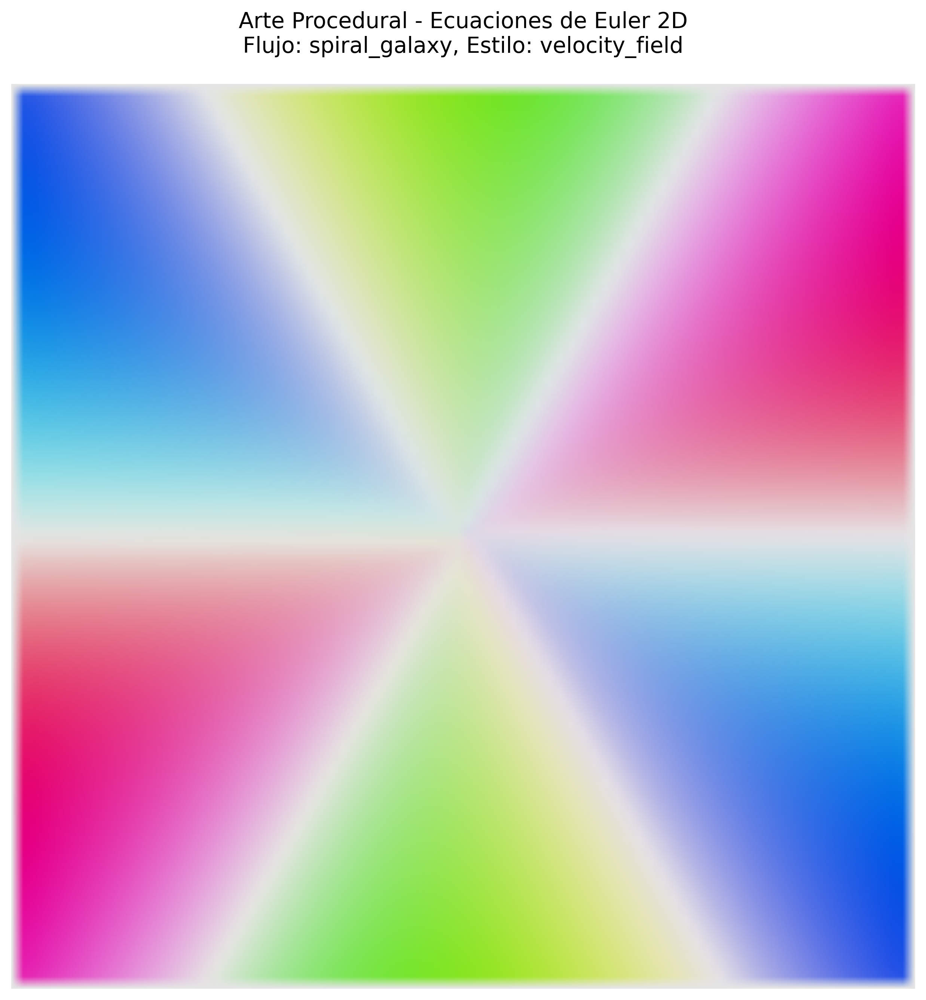

# 🌊 Generador de Arte Procedural con Ecuaciones de Euler 2D

Este proyecto genera arte visual dinámico mediante la simulación de campos de flujo usando las ecuaciones de Euler para fluidos incompresibles en 2D. El generador crea patrones artísticos únicos basados en la física de fluidos, produciendo imágenes y animaciones hipnotizantes que evolucionan en tiempo real.

## 🎨 Características Principales

- **Simulación Física Realista**: Implementa las ecuaciones de Euler para fluidos 2D con advección, difusión viscosa y fuerzas dinámicas
- **Múltiples Patrones de Flujo**: Soporte para diferentes tipos de inicialización del campo de flujo
- **Estilos de Arte Variados**: Diferentes métodos de renderizado y coloración
- **Animaciones Dinámicas**: Capacidad de generar GIFs animados del proceso evolutivo
- **Fuerzas Externas Dinámicas**: Vórtices móviles y perturbaciones que evolucionan en el tiempo

## 🚀 Instalación

### Requisitos del Sistema

```bash
python >= 3.7
numpy
matplotlib
scipy
```

### Instalación de Dependencias

```bash
pip install numpy matplotlib scipy
```

### Clonación del Repositorio

```bash
git clone https://github.com/tu-usuario/euler-art-generator.git
cd euler-art-generator
```

## 🎯 Uso Básico

### Ejecución Simple

```bash
python Euler2d2.py
```

### Uso Programático

```python
from Euler2d2 import EulerArtGenerator

# Crear instancia del generador
generator = EulerArtGenerator(width=800, height=600, resolution=120)

# Generar arte estático
art = generator.generate_static_art(
    steps=200,
    flow_type='vortex_dance',
    art_style='mixed_media',
    save_path='mi_arte.png'
)

# Crear animación
animation = generator.create_animation(
    frames=100,
    flow_type='spiral_galaxy',
    art_style='velocity_field',
    save_path='mi_animacion.gif'
)
```

## 🌀 Tipos de Flujo Disponibles

### 1. Danza de Vórtices (`vortex_dance`)
Múltiples vórtices con diferentes fuerzas y posiciones que interactúan dinámicamente.

**Características:**
- 4 vórtices con fuerzas variables (-3.5 a 3.0)
- Rotación en direcciones opuestas
- Interacciones complejas entre vórtices

### 2. Galaxia Espiral (`spiral_galaxy`)
Campo tipo galaxia espiral con velocidad radial y tangencial.

**Características:**
- Centro gravitacional único
- Velocidad tangencial decreciente con la distancia
- Patrones espirales naturales

### 3. Océano Turbulento (`turbulent_ocean`)
Turbulencia pseudo-aleatoria con múltiples modos de frecuencia.

**Características:**
- 12 modos de onda superpuestos
- Frecuencias y amplitudes aleatorias
- Patrones de turbulencia realistas

## 🎨 Estilos de Arte

### 1. Flujo de Vorticidad (`vorticity_flow`)
Visualización basada en la vorticidad del campo usando colores HSV vibrantes.

### 2. Campo de Velocidad (`velocity_field`)
Colores basados en magnitud y dirección de la velocidad.

### 3. Medios Mixtos (`mixed_media`)
Combinación dinámica de vorticidad y velocidad con pesos oscilantes.

## 📊 Evidencias de Ejecución

### Arte Estático Generado

#### Danza de Vórtices - Estilo Medios Mixtos


*Arte generado con el patrón 'vortex_dance' y estilo 'mixed_media' después de 150 pasos de simulación.*

#### Galaxia Espiral - Campo de Velocidad


*Visualización del patrón 'spiral_galaxy' usando el estilo 'velocity_field' con 200 pasos de evolución.*

### Animaciones Dinámicas

#### Evolución Temporal de Vórtices


*Animación de 60 frames mostrando la evolución temporal del patrón 'vortex_dance' con fuerzas dinámicas y perturbaciones.*

## ⚙️ Parámetros de Configuración

### Constructor Principal

```python
EulerArtGenerator(width=800, height=600, resolution=100)
```

- **width**: Ancho del canvas en píxeles
- **height**: Alto del canvas en píxeles  
- **resolution**: Resolución de la grilla computacional

### Parámetros Físicos

- **viscosity**: Coeficiente de viscosidad (default: 0.01)
- **dt**: Paso temporal de la simulación (default: 0.01)
- **force_evolution_rate**: Tasa de evolución de fuerzas dinámicas

### Generación de Arte

```python
generate_static_art(steps=200, flow_type='vortex_dance', 
                   art_style='mixed_media', save_path=None)
```

- **steps**: Número de pasos de simulación
- **flow_type**: Tipo de inicialización del flujo
- **art_style**: Estilo de renderizado
- **save_path**: Ruta de guardado (opcional)

## 🔬 Fundamentos Científicos

### Ecuaciones de Euler 2D

El generador implementa las ecuaciones de Euler para fluidos incompresibles:

```
∂u/∂t + (u·∇)u = -∇p + ν∇²u
∇·u = 0
```

Donde:
- **u** = campo de velocidad (u, v)
- **p** = presión
- **ν** = viscosidad cinemática
- **∇** = operador nabla

### Métodos Numéricos

1. **Advección**: Método MacCormack para estabilidad numérica
2. **Difusión**: Operador Laplaciano con diferencias finitas
3. **Vorticidad**: Cálculo mediante ∂v/∂x - ∂u/∂y
4. **Fuerzas Externas**: Vórtices móviles con evolución temporal

## 🛠️ Características Técnicas

### Estabilidad Numérica
- Clipping de valores extremos para prevenir inestabilidades
- Manejo seguro de valores NaN e infinitos
- Resolución automática ajustada a dimensiones del canvas

### Optimizaciones
- Uso eficiente de NumPy para operaciones vectorizadas
- Condiciones de frontera apropiadas
- Inyección periódica de energía para mantener dinámicas

### Robustez
- Validación automática de parámetros
- Manejo de errores por división por cero
- Verificaciones de seguridad en conversiones de color

## 📈 Rendimiento

### Configuraciones Recomendadas

| Resolución | Tiempo por Frame | Calidad Visual | Uso Recomendado |
|------------|------------------|----------------|-----------------|
| 50x50      | ~0.1s           | Baja           | Pruebas rápidas |
| 100x100    | ~0.5s           | Media          | Uso general     |
| 200x200    | ~2.0s           | Alta           | Arte final      |

## 🎯 Casos de Uso

### Arte Generativo
- Creación de fondos únicos para diseño gráfico
- Texturas procedurales para videojuegos
- Arte digital para exposiciones interactivas

### Visualización Científica
- Demostración de conceptos de dinámica de fluidos
- Educación en física computacional
- Investigación en turbulencia 2D

### Entretenimiento
- Screensavers dinámicos
- Visualizaciones musicales reactivas
- Contenido para redes sociales

## 🤝 Contribuciones

Las contribuciones son bienvenidas. Por favor:

1. Fork el repositorio
2. Crea una rama para tu feature (`git checkout -b feature/nueva-caracteristica`)
3. Commit tus cambios (`git commit -am 'Añadir nueva característica'`)
4. Push a la rama (`git push origin feature/nueva-caracteristica`)
5. Abre un Pull Request

## 📝 Notas Técnicas

### Limitaciones Conocidas
- La resolución está limitada por la memoria disponible
- Simulaciones largas pueden requerir ajuste de parámetros de estabilidad
- Los patrones extremadamente caóticos pueden requerir mayor viscosidad

### Desarrollo Futuro
- [ ] Soporte para fluidos compresibles
- [ ] Implementación GPU con CUDA
- [ ] Interfaz gráfica interactiva
- [ ] Exportación a formatos vectoriales
- [ ] Integración con audio para visualizaciones musicales

## 📄 Licencia

Este proyecto está bajo la Licencia MIT. Ver el archivo `LICENSE` para más detalles.

## 👨‍💻 Autor

Desarrollado como una exploración de la intersección entre física computacional y arte generativo.

---

*"Donde la matemática encuentra el arte, surgen las formas más hermosas de la naturaleza."*
